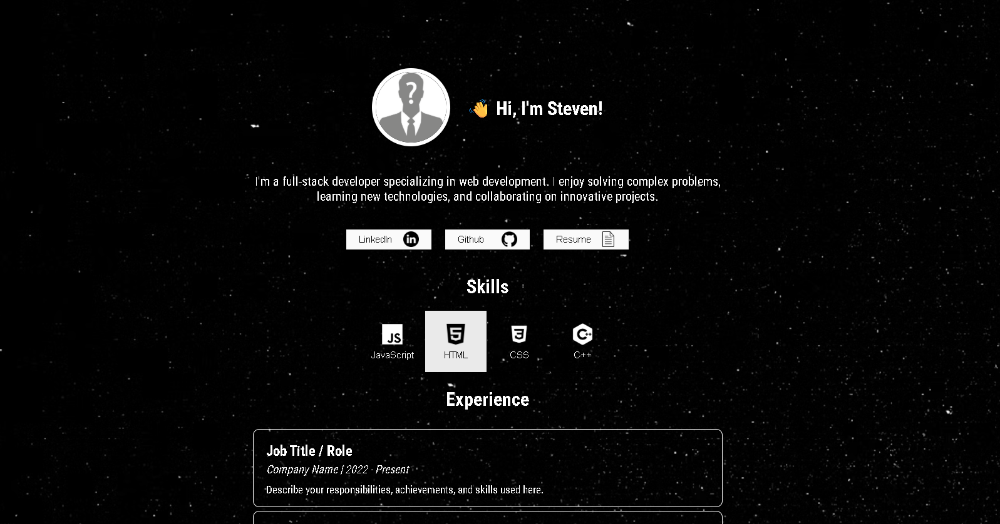

# Portfolio Template

A simple and customizable **portfolio template** built using **HTML, CSS, and JavaScript**.  
You can use this template to quickly create a personal website showcasing your skills, experience, and projects.



---

## Features

- **Intro Section** with name, short description, and social links  
- **Skills Section** with icon-based skill buttons  
- **Experience Section** to list job or project experience 
- **Projects Section** with image, title, and description  
- **Hover Effects** for interactive cards and buttons  
- **Responsive Layout** (works on desktop and mobile)

---

## How to Use

1. **Clone or download this repository**

```bash
git clone https://github.com/Gojus1/Portfolio_site_template.git
```
2. **Open index.html in your browser to preview.**

3. **Customize content**

4. **Deploy with GitHub Pages:**

   - Go to your repo Settings → Pages

   - Set branch to main and folder to / (root)

   - Your site will be live at https://Gojus1.github.io/Portfolio-site-template
